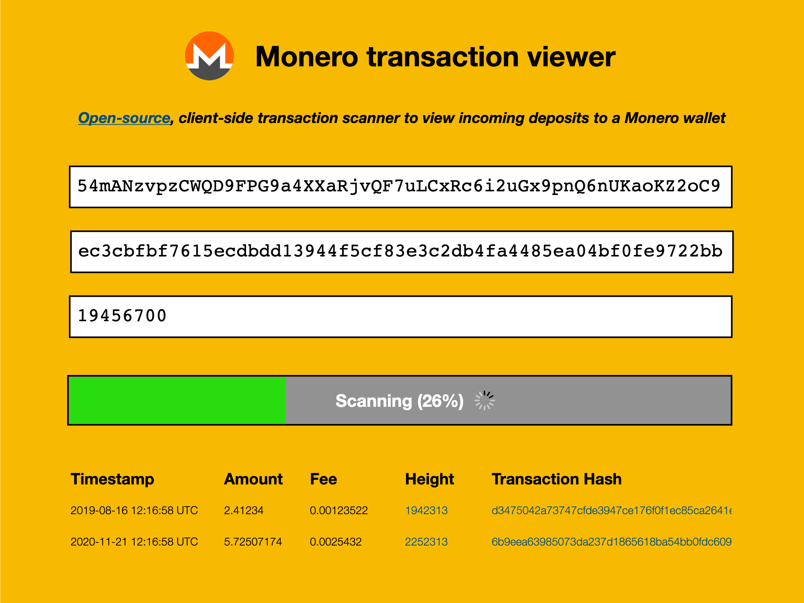

## Description

Open-source, client-side transaction scanner to view incoming deposits to a Monero wallet.

Note: not yet implemented (help wanted!), currently a clone of [monerostresstester](https://github.com/woodser/monerostresstester.com).

## How to Run in a Browser
1. Download and install [Monero CLI](https://getmonero.org/downloads/)
2. Start monero-daemon-rpc with authentication and CORS access.  For example: `./monerod --stagenet --rpc-login superuser:abctesting123 --rpc-access-control-origins http://localhost:8080`
3. `git clone https://github.com/woodser/monerotxviewer`
4. `cd monerotxviewer`
5. `npm install`
6. `npm start`
7. Access web app at http://localhost:8080 (opens automatically)

## UI Design
Initial homepage design.  See [design.pdf](design.pdf) for more mockups.

	 

